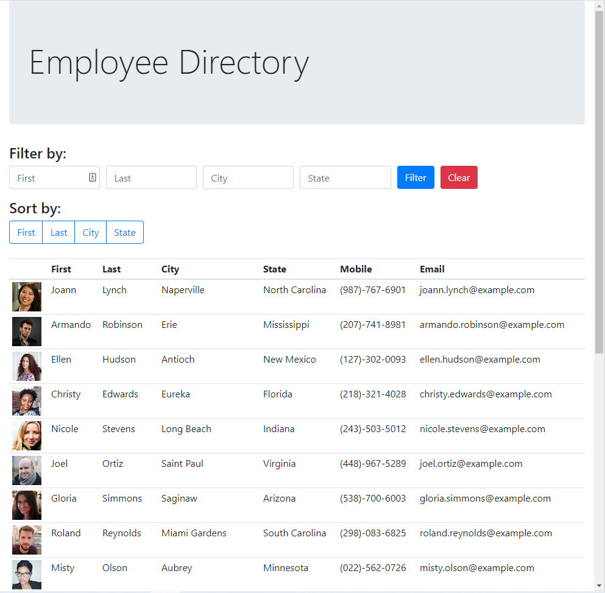

# Random User
  
  ## Description
  Employee directory with React that has a table of random users generated from the Random User API.

  Deployed at [GitHub Pages](https://danielryangreen.github.io/random-user/).

  See the repo at [GitHub](https://github.com/danielryangreen/random-user).

  
  ## Table of Contents
  * [Installation](#installation)
  * [Usage](#usage)
  * [Credits](#credits)
  * [License](#license)
  * [Contributing](#contributing)
  * [Tests](#tests)
  * [Questions](#questions)
  ## Installation
  To install required packages, enter `npm i` in the terminal.
  ## Usage
  To run the application, navigate to the `src` directory in the terminal and enter `npm start`.
  ## Credits
  The following resources were used in this project:

  - [Random User API](https://randomuser.me/)
  - [Node.js](https://nodejs.org/en/)
  - [React](https://reactjs.org/)
  - [Bootstrap](https://getbootstrap.com/docs/4.6/getting-started/introduction/)
  - [npm axios](https://www.npmjs.com/package/axios)
  - [npm gh-pages](https://www.npmjs.com/package/gh-pages)
  ## License
  This project is covered under the MIT license.
  ## Contributing
  Please submit a pull request.
  ## Tests
  Not provided.
  ## Questions
  Please contact me at dan.ryan.green@gmail.com. See my work on GitHub at [danielryangreen](https://github.com/danielryangreen/).